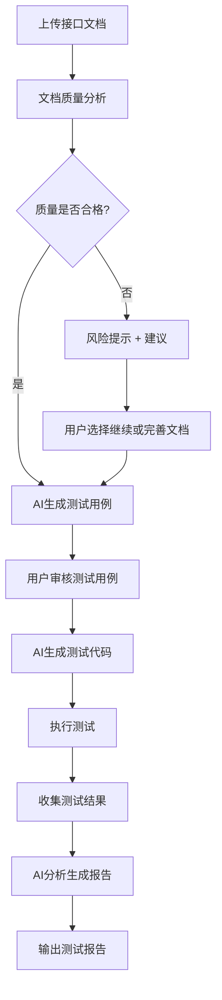

# Spec2Test 产品需求文档 (PRD)

**版本**: v1.0  
**创建时间**: 2025年  
**产品经理**: Sean  
**状态**: 草稿

---

## 1. 产品概述

### 1.1 产品愿景
让AI驱动的自动化测试触手可及，从接口文档到测试报告一键完成。

### 1.2 产品定位
**Spec2Test** 是一个AI驱动的自动化测试流水线工具，专注于解决"测试自动化门槛高"的行业痛点，通过LLM能力实现从规范文档到测试报告的全流程自动化。

### 1.3 目标用户

#### 主要用户
- **后端开发工程师**: 需要快速验证API接口功能
- **测试工程师**: 希望提高测试效率，减少重复劳动
- **QA团队**: 需要全面的接口测试覆盖

#### 次要用户
- **产品经理**: 需要了解接口质量状况
- **技术负责人**: 需要测试报告进行质量评估

### 1.4 核心价值主张
- **零配置**: 从文档直接到测试，无需复杂配置
- **智能化**: AI理解业务逻辑，生成高质量测试用例
- **全流程**: 端到端的自动化，从解析到报告
- **高效率**: 大幅减少测试用例编写时间

---

## 2. 市场分析

### 2.1 市场现状
- 传统测试工具配置复杂，学习成本高
- 手动编写测试用例耗时且容易遗漏
- 缺乏智能化的测试用例生成工具
- AI在测试领域的应用还处于早期阶段

### 2.2 竞品分析

| 产品 | 优势 | 劣势 | 差异化 |
|------|------|------|--------|
| Postman + Newman | 生态成熟，用户基数大 | 需要手动编写用例，无AI能力 | 我们提供AI自动生成 |
| Swagger Codegen | 支持多语言代码生成 | 生成的测试用例简单，覆盖不全 | 我们提供智能用例生成 |
| Insomnia | 界面友好，API调试方便 | 测试自动化能力弱 | 我们专注自动化流水线 |

### 2.3 市场机会
- **AI技术成熟**: GPT-4等大模型能力足够支撑智能测试生成
- **开发效率需求**: 敏捷开发对测试效率要求越来越高
- **人力成本上升**: 自动化测试需求强烈
- **API经济兴起**: 微服务架构下接口测试需求激增

---

## 3. 产品目标

### 3.1 业务目标
- **短期目标** (3个月): 完成MVP，获得100个早期用户
- **中期目标** (6个月): 支持3种测试类型，用户数达到1000
- **长期目标** (12个月): 成为AI测试领域的标杆产品

### 3.2 用户目标
- 将接口测试用例编写时间减少80%
- 提高测试覆盖率到90%以上
- 降低测试自动化门槛，让非专业人员也能使用

### 3.3 技术目标
- 文档解析准确率 > 95%
- 测试用例生成覆盖率 > 85%
- 测试执行成功率 > 90%
- 系统响应时间 < 30秒

---

## 4. 功能需求

### 4.1 核心功能流程

### 4.2 MVP功能清单

#### 4.2.1 文档解析模块
- **输入支持**: OpenAPI 3.0 (YAML/JSON)
- **解析能力**: 提取接口路径、方法、参数、响应
- **质量分析**: 评估文档完整性，给出质量等级
- **风险提示**: 识别缺失信息，提供改进建议

#### 4.2.2 测试用例生成模块
- **AI驱动**: 基于GPT-4的智能用例生成
- **用例类型**: 正常流程、异常流程、边界条件、安全测试
- **覆盖策略**: 路径覆盖 + 数据覆盖 + 业务场景覆盖
- **用例审核**: 用户可查看、编辑、删除生成的用例

#### 4.2.3 代码生成模块
- **框架支持**: Python + pytest (MVP阶段)
- **代码质量**: 生成可读、可维护的测试代码
- **断言丰富**: 状态码、响应时间、数据结构验证
- **配置灵活**: 支持环境变量、全局配置

#### 4.2.4 测试执行模块
- **本地执行**: 支持本地环境测试运行
- **并发控制**: 支持并发执行，提高效率
- **错误处理**: 优雅处理网络异常、超时等问题
- **实时反馈**: 显示执行进度和状态

#### 4.2.5 报告生成模块
- **多格式输出**: HTML、JSON、PDF报告
- **AI分析**: 智能分析测试结果，提供改进建议
- **可视化**: 图表展示测试覆盖率、成功率等指标
- **问题定位**: 突出显示失败用例和错误原因

### 4.3 后续版本功能

#### V2.0 - Prompt测试流水线
- 支持Prompt模板测试
- AI效果评估指标
- A/B测试能力

#### V3.0 - 功能测试流水线
- UI自动化测试
- 端到端测试场景
- 跨平台支持

---

## 5. 非功能需求

### 5.1 性能需求
- **响应时间**: 单个接口用例生成 < 10秒
- **并发能力**: 支持10个用户同时使用
- **文档大小**: 支持最大10MB的接口文档
- **测试规模**: 单次最多生成100个测试用例

### 5.2 可用性需求
- **易用性**: 新用户5分钟内完成首次测试
- **容错性**: 对不完整文档有良好的处理能力
- **反馈**: 每个操作都有明确的状态反馈
- **帮助**: 提供详细的使用文档和示例

### 5.3 可靠性需求
- **稳定性**: 系统可用性 > 99%
- **数据安全**: 用户上传的文档不会泄露
- **错误恢复**: 支持操作失败后的重试机制

### 5.4 扩展性需求
- **插件架构**: 支持新的文档格式和测试框架
- **API接口**: 提供REST API供第三方集成
- **配置化**: 核心逻辑可通过配置调整

---

## 6. 用户体验设计

### 6.1 用户旅程

#### 首次使用流程
1. **欢迎页面**: 简单介绍产品价值和使用流程
2. **示例演示**: 提供示例文档，让用户快速体验
3. **上传文档**: 支持拖拽上传，实时验证格式
4. **质量分析**: 显示文档分析结果和改进建议
5. **生成用例**: 展示AI生成过程，增加信任感
6. **审核编辑**: 用户友好的用例编辑界面
7. **执行测试**: 实时显示执行进度
8. **查看报告**: 直观的测试结果展示

### 6.2 界面设计原则
- **简洁明了**: 避免复杂的配置选项
- **渐进式披露**: 高级功能隐藏在二级菜单
- **即时反馈**: 每个操作都有明确的状态提示
- **错误友好**: 错误信息要具体且提供解决方案

### 6.3 关键页面设计

#### 主页面
- 文档上传区域（拖拽支持）
- 最近项目列表
- 快速开始指南

#### 文档分析页面
- 质量评分可视化
- 风险提示列表
- 改进建议
- 继续/返回操作

#### 用例生成页面
- 生成进度条
- 用例预览列表
- 编辑/删除操作
- 批量操作功能

#### 测试执行页面
- 实时执行状态
- 成功/失败统计
- 错误日志查看
- 停止/重试操作

#### 报告页面
- 测试结果概览
- 详细测试报告
- AI分析建议
- 导出功能

---

## 7. 技术架构

### 7.1 整体架构

### 7.2 技术选型

#### 后端技术栈
- **语言**: Python 3.9+
- **框架**: FastAPI (高性能异步框架)
- **AI集成**: LangChain + OpenAI API
- **数据库**: PostgreSQL (主数据) + Redis (缓存)
- **文件存储**: MinIO (兼容S3)
- **任务队列**: Celery + Redis

#### 前端技术栈 (后续版本)
- **框架**: React 18 + TypeScript
- **UI库**: Ant Design
- **状态管理**: Zustand
- **构建工具**: Vite

#### 部署技术栈
- **容器化**: Docker + Docker Compose
- **编排**: Kubernetes (生产环境)
- **监控**: Prometheus + Grafana
- **日志**: ELK Stack

### 7.3 数据模型

#### 核心实体
- **Project**: 项目信息
- **Document**: 接口文档
- **TestSuite**: 测试套件
- **TestCase**: 测试用例
- **TestResult**: 测试结果
- **TestReport**: 测试报告

---

## 8. 实施计划

### 8.1 开发里程碑

#### Phase 1: 基础架构 (Week 1-2)
- [x] 项目结构搭建
- [x] 核心数据模型定义
- [x] 配置管理系统
- [ ] 基础API框架
- [ ] 数据库设计和迁移

#### Phase 2: 核心功能 (Week 3-6)
- [ ] OpenAPI文档解析器
- [ ] AI测试用例生成器
- [ ] 测试代码生成器
- [ ] 测试执行引擎
- [ ] 基础报告生成

#### Phase 3: 完善优化 (Week 7-8)
- [ ] 错误处理和异常恢复
- [ ] 性能优化
- [ ] 用户体验优化
- [ ] 文档和示例

#### Phase 4: 测试发布 (Week 9-10)
- [ ] 全面测试
- [ ] 安全审计
- [ ] 部署脚本
- [ ] MVP发布

### 8.2 资源需求
- **开发人员**: 1名全栈工程师 (Sean)
- **AI服务**: OpenAI API额度
- **基础设施**: 云服务器 + 数据库
- **时间投入**: 10周全职开发

---

## 9. 风险评估

### 9.1 技术风险

| 风险 | 概率 | 影响 | 应对策略 |
|------|------|------|----------|
| AI生成质量不稳定 | 中 | 高 | 建立质量评估机制，提供人工审核 |
| LLM API限制 | 低 | 中 | 支持多个LLM提供商，本地模型备选 |
| 文档格式兼容性 | 中 | 中 | 优先支持主流格式，逐步扩展 |
| 性能瓶颈 | 低 | 中 | 异步处理，缓存优化 |

### 9.2 市场风险

| 风险 | 概率 | 影响 | 应对策略 |
|------|------|------|----------|
| 竞品快速跟进 | 中 | 中 | 保持技术领先，建立用户粘性 |
| 用户接受度低 | 低 | 高 | 充分用户调研，快速迭代 |
| AI技术变化 | 中 | 中 | 保持技术敏感度，及时升级 |

### 9.3 业务风险

| 风险 | 概率 | 影响 | 应对策略 |
|------|------|------|----------|
| 开发周期延长 | 中 | 中 | 合理规划，MVP优先 |
| 资源不足 | 低 | 中 | 分阶段投入，寻求合作 |
| 法律合规 | 低 | 高 | 数据安全设计，合规审查 |

---

## 10. 成功指标

### 10.1 产品指标
- **用户增长**: 月活用户数
- **使用频率**: 用户平均使用次数
- **功能采用**: 各功能模块使用率
- **用户满意度**: NPS评分

### 10.2 技术指标
- **系统性能**: 响应时间、吞吐量
- **稳定性**: 系统可用性、错误率
- **AI效果**: 用例生成质量、用户接受率

### 10.3 业务指标
- **转化率**: 试用到付费的转化
- **留存率**: 用户留存情况
- **推荐度**: 用户推荐意愿

---

## 11. 后续规划

### 11.1 产品路线图
- **Q1**: API测试流水线MVP
- **Q2**: Prompt测试流水线
- **Q3**: 功能测试流水线
- **Q4**: 企业级功能和私有部署

### 11.2 商业化策略
- **免费版**: 基础API测试功能
- **专业版**: 高级功能 + 更多配额
- **企业版**: 私有部署 + 定制服务

### 11.3 生态建设
- **开源社区**: 核心功能开源
- **插件市场**: 第三方插件生态
- **合作伙伴**: 与测试工具厂商合作

---

**文档状态**: 待评审  
**下次更新**: 根据评审反馈调整  
**联系人**: Sean (产品负责人)